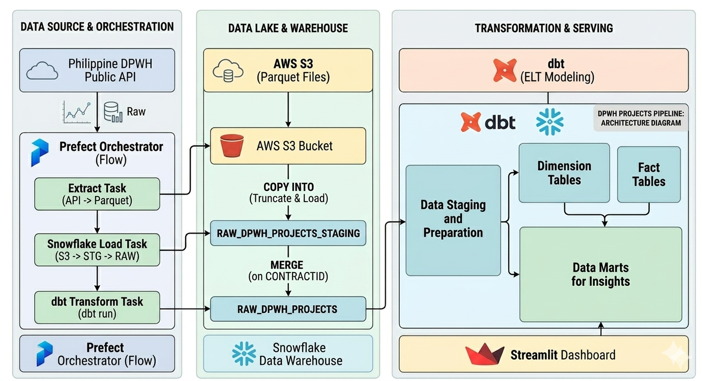

# DPWH Projects Pipeline

An end-to-end data pipeline that ingests Philippine **DPWH (Department of Public
Works and Highways)** infrastructure project data from the public transparency
API, lands it in S3, loads it into Snowflake, and transforms it with dbt into a
star schema of fact / dimension / bridge / mart models for analytics.

Personal data-engineering project, run on a **monthly** cadence.

---

## What it does

The DPWH transparency portal publishes ~252,000 infrastructure contracts — budget,
status, location, contractor, and progress for every road, bridge, flood-control,
and building project in the country. This pipeline pulls that data on a schedule
and turns the raw, messy API response into clean analytical tables that answer
questions like:

- Where is the infrastructure budget going, by province / region / island group?
- Which contractors deliver the most work, and who has the worst delay or
  "ghost project" (funded but zero-progress) rates?
- How is the budget split across infrastructure categories?
- Everything about a single contract, in one row.

---

## Architecture



**Orchestrated by Prefect**, scheduled monthly at `00:01 Asia/Manila` on the 1st.

### Tech stack

| Layer | Tech |
|---|---|
| Orchestration | Prefect 3 (`orchestration/src/main.py`, scheduled via `prefect.yaml`) |
| Extract | `curl_cffi` with rotating TLS fingerprints (the API is Cloudflare-protected) |
| Storage | AWS S3 (single overwriting parquet file) |
| Warehouse | Snowflake (`DPWH_PROJECTS_DB`; schemas `RAW`, `DEV`, `PROD`) |
| Transformation | dbt-snowflake + `dbt_utils` |
| Local runtime | Python venv (`.venv/`), Windows / PowerShell |

### The data model (star schema)

One row per `contract_id` at the centre (`fct_projects`); the two many-to-many
relationships (contractor, category) live in bridges so the fact stays at project
grain.

```
stg_dpwh_projects (view)
    ├──► int_contractors_parsed ──► dim_contractors
    │                          └──► brg_contractors ─┐
    ├──► dim_locations                                │
    ├──► brg_project_categories ── dim_categories     │
    └──► fct_projects ◄───────────────────────────────┘
                ├──► mart_budget_by_location      (province grain)
                ├──► mart_budget_by_category       (category grain)
                ├──► mart_contractor_performance   (contractor grain)
                └──► mart_projects_overview         (project grain, flat)
```

Every model is documented — *what it is, its columns, and why each decision was
made* — under **[`docs/`](docs/README.md)** (one `.md` per model). Column-level
descriptions and dbt tests live next to the SQL in each folder's `schema.yml`.

---
